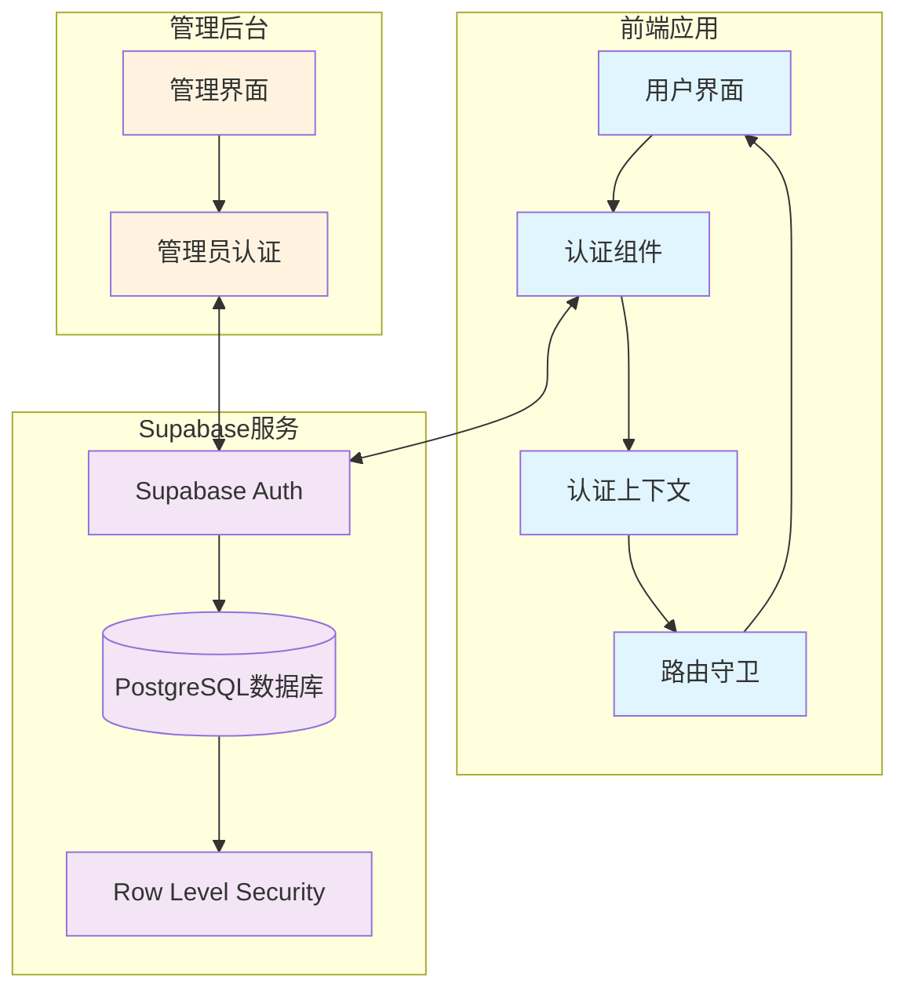
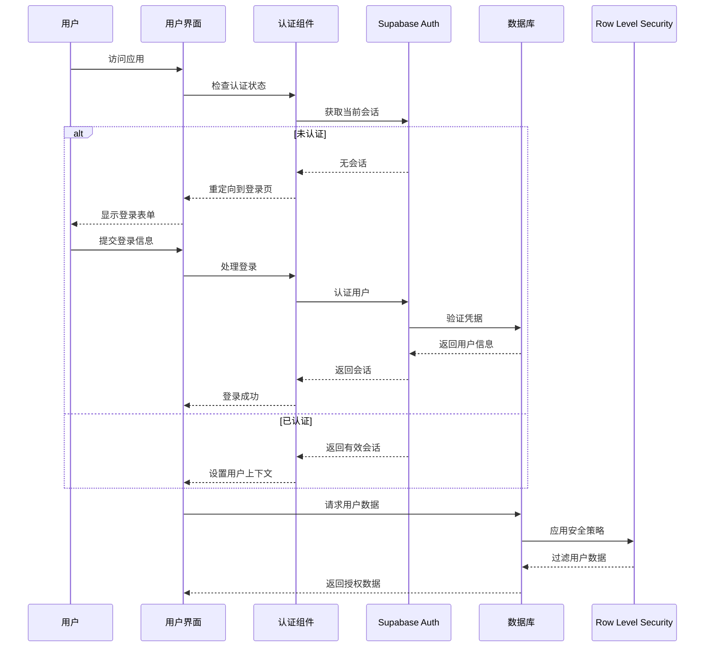

# 设计文档

## 概述

本设计文档描述了基于Supabase的认证系统架构，该系统将为智能生活管家应用提供安全的用户认证、会话管理和数据隔离功能。系统采用React + TypeScript技术栈，利用Supabase的内置认证服务和Row Level Security (RLS) 功能确保用户数据的完全隔离。

## 架构

### 系统架构图



### 认证流程图



## 组件和接口

### 1. 认证上下文 (AuthContext)

```typescript
interface AuthContextType {
  user: User | null;
  session: Session | null;
  loading: boolean;
  signIn: (email: string, password: string) => Promise<AuthResponse>;
  signUp: (email: string, password: string) => Promise<AuthResponse>;
  signOut: () => Promise<void>;
  resetPassword: (email: string) => Promise<AuthResponse>;
}
```

### 2. 认证组件接口

```typescript
interface AuthComponentProps {
  mode: 'signin' | 'signup' | 'reset';
  onSuccess?: (user: User) => void;
  onError?: (error: AuthError) => void;
  redirectTo?: string;
}

interface LoginFormData {
  email: string;
  password: string;
  rememberMe?: boolean;
}

interface SignupFormData {
  email: string;
  password: string;
  confirmPassword: string;
}
```

### 3. 路由守卫接口

```typescript
interface ProtectedRouteProps {
  children: React.ReactNode;
  requireAuth?: boolean;
  requireAdmin?: boolean;
  fallback?: React.ComponentType;
  redirectTo?: string;
}

interface RouteGuardConfig {
  publicRoutes: string[];
  protectedRoutes: string[];
  adminRoutes: string[];
  loginRoute: string;
  defaultRoute: string;
}
```

### 4. 会话管理接口

```typescript
interface SessionManager {
  getCurrentSession: () => Promise<Session | null>;
  refreshSession: () => Promise<Session | null>;
  clearSession: () => Promise<void>;
  onSessionChange: (callback: (session: Session | null) => void) => () => void;
}
```

## 数据模型

### 用户配置文件表 (profiles)

```sql
CREATE TABLE profiles (
  id UUID REFERENCES auth.users(id) PRIMARY KEY,
  email TEXT UNIQUE NOT NULL,
  username TEXT,
  avatar_url TEXT,
  created_at TIMESTAMP WITH TIME ZONE DEFAULT NOW(),
  updated_at TIMESTAMP WITH TIME ZONE DEFAULT NOW()
);
```

### 用户角色表 (user_roles)

```sql
CREATE TABLE user_roles (
  id UUID DEFAULT gen_random_uuid() PRIMARY KEY,
  user_id UUID REFERENCES auth.users(id) NOT NULL,
  role TEXT NOT NULL DEFAULT 'user',
  created_at TIMESTAMP WITH TIME ZONE DEFAULT NOW(),
  UNIQUE(user_id, role)
);
```

### Row Level Security 策略

#### 用户配置文件策略

```sql
-- 启用RLS
ALTER TABLE profiles ENABLE ROW LEVEL SECURITY;

-- 用户只能查看自己的配置文件
CREATE POLICY "Users can view own profile" ON profiles
  FOR SELECT USING (auth.uid() = id);

-- 用户只能更新自己的配置文件
CREATE POLICY "Users can update own profile" ON profiles
  FOR UPDATE USING (auth.uid() = id);

-- 用户只能插入自己的配置文件
CREATE POLICY "Users can insert own profile" ON profiles
  FOR INSERT WITH CHECK (auth.uid() = id);
```

#### 任务表策略

```sql
-- 启用RLS
ALTER TABLE tasks ENABLE ROW LEVEL SECURITY;

-- 用户只能查看自己的任务
CREATE POLICY "Users can view own tasks" ON tasks
  FOR SELECT USING (auth.uid() = user_id);

-- 用户只能创建属于自己的任务
CREATE POLICY "Users can create own tasks" ON tasks
  FOR INSERT WITH CHECK (auth.uid() = user_id);

-- 用户只能更新自己的任务
CREATE POLICY "Users can update own tasks" ON tasks
  FOR UPDATE USING (auth.uid() = user_id);

-- 用户只能删除自己的任务
CREATE POLICY "Users can delete own tasks" ON tasks
  FOR DELETE USING (auth.uid() = user_id);
```

#### 管理员策略

```sql
-- 管理员可以查看所有数据
CREATE POLICY "Admins can view all data" ON tasks
  FOR SELECT USING (
    EXISTS (
      SELECT 1 FROM user_roles 
      WHERE user_id = auth.uid() 
      AND role = 'admin'
    )
  );
```

## 正确性属性

*属性是一个特征或行为，应该在系统的所有有效执行中保持为真——本质上是关于系统应该做什么的正式声明。属性作为人类可读规范和机器可验证正确性保证之间的桥梁。*

现在我需要使用prework工具来分析验收标准的可测试性：
基于预工作分析，我将把验收标准转换为可测试的属性：

### 属性 1: 用户注册验证
*对于任何* 注册请求，如果提供有效的用户信息（有效邮箱格式、符合强度要求的密码），则系统应该成功创建用户账户并发送验证邮件
**验证需求: Requirements 1.2**

### 属性 2: 无效注册拒绝
*对于任何* 无效的注册信息（无效邮箱格式、弱密码、已存在邮箱），系统应该拒绝注册并显示相应的错误消息
**验证需求: Requirements 1.3, 1.4, 1.5**

### 属性 3: 登录认证流程
*对于任何* 有效的用户凭据，登录应该成功验证身份、创建会话并重定向到主应用界面
**验证需求: Requirements 2.2, 2.4**

### 属性 4: 无效登录拒绝
*对于任何* 无效的登录凭据，系统应该拒绝登录并显示"邮箱或密码错误"的错误消息
**验证需求: Requirements 2.3**

### 属性 5: 会话状态管理
*对于任何* 会话状态变化（建立、过期、登出），认证上下文应该通知所有订阅组件并更新相应的访问权限
**验证需求: Requirements 3.2, 3.5**

### 属性 6: 数据隔离保证
*对于任何* 已认证用户的数据操作，系统应该确保用户只能访问和修改属于自己的数据，所有数据库查询自动添加用户ID过滤条件
**验证需求: Requirements 3.6, 8.1, 8.2, 8.3, 8.4**

### 属性 7: 路由访问控制
*对于任何* 路由访问请求，路由守卫应该根据用户认证状态和权限正确允许或拒绝访问，未认证用户被重定向到登录页面
**验证需求: Requirements 4.1, 4.2, 4.4**

### 属性 8: 管理员权限验证
*对于任何* 管理后台访问请求，系统应该验证用户具有管理员权限，非管理员用户被拒绝访问并显示权限不足消息
**验证需求: Requirements 6.2, 6.3, 6.5, 8.5**

### 属性 9: 密码重置流程
*对于任何* 有效的密码重置请求，系统应该发送重置邮件，允许用户通过有效链接设置新密码
**验证需求: Requirements 7.2, 7.4**

### 属性 10: 响应式界面适配
*对于任何* 屏幕尺寸和设备类型，用户界面应该提供适当的响应式布局和触摸友好的交互体验
**验证需求: Requirements 5.2**

### 属性 11: 输入验证反馈
*对于任何* 用户表单输入，系统应该提供实时验证反馈，包括格式要求说明和错误消息
**验证需求: Requirements 5.3, 9.3**

### 属性 12: 用户反馈系统
*对于任何* 系统操作（成功或失败），用户界面应该显示适当的状态指示器和用户友好的反馈消息
**验证需求: Requirements 5.4, 5.5, 9.4, 9.5**

## 错误处理

### 错误分类和处理策略

#### 1. 网络错误
- **连接超时**: 显示重试选项，自动重试机制
- **网络不可用**: 离线模式提示，缓存关键数据
- **服务器错误**: 友好的错误消息，错误日志记录

#### 2. 认证错误
- **无效凭据**: 清晰的错误提示，不泄露敏感信息
- **会话过期**: 自动重定向到登录页面，保存用户当前状态
- **权限不足**: 明确的权限说明，引导用户正确操作

#### 3. 验证错误
- **输入格式错误**: 实时验证提示，具体的格式要求
- **业务规则违反**: 清晰的业务规则说明
- **数据冲突**: 友好的冲突解决建议

#### 4. 系统错误
- **未预期错误**: 通用错误消息，详细错误日志
- **资源不足**: 系统状态说明，建议操作
- **配置错误**: 开发环境下的详细信息，生产环境下的通用提示

### 错误恢复机制

```typescript
interface ErrorRecoveryStrategy {
  retryable: boolean;
  maxRetries: number;
  backoffStrategy: 'linear' | 'exponential';
  fallbackAction?: () => void;
  userMessage: string;
  logLevel: 'error' | 'warn' | 'info';
}
```

## 测试策略

### 双重测试方法

我们将采用单元测试和基于属性的测试相结合的方法：

- **单元测试**: 验证特定示例、边缘情况和错误条件
- **属性测试**: 验证跨所有输入的通用属性
- 两者互补，提供全面覆盖（单元测试捕获具体错误，属性测试验证一般正确性）

### 单元测试重点

单元测试应专注于：
- 演示正确行为的特定示例
- 组件之间的集成点
- 边缘情况和错误条件

### 基于属性的测试配置

- **测试库**: 使用 `fast-check` 进行TypeScript的基于属性测试
- **最小迭代次数**: 每个属性测试至少100次迭代（由于随机化）
- **测试标记**: 每个属性测试必须引用其设计文档属性
- **标记格式**: **Feature: supabase-authentication, Property {number}: {property_text}**
- **实现要求**: 每个正确性属性必须由单个基于属性的测试实现

### 测试覆盖范围

#### 认证流程测试
- 注册流程的各种输入组合
- 登录流程的成功和失败场景
- 会话管理的状态转换
- 密码重置的完整流程

#### 数据隔离测试
- 用户数据访问权限验证
- Row Level Security策略测试
- 跨用户数据泄露防护
- 管理员权限边界测试

#### 用户界面测试
- 响应式设计在不同设备上的表现
- 表单验证的实时反馈
- 错误消息的显示和清除
- 加载状态的正确显示

#### 错误处理测试
- 网络错误的恢复机制
- 认证错误的用户引导
- 系统错误的日志记录
- 边缘情况的优雅降级

### 测试数据生成策略

#### 智能生成器设计
- **用户数据生成器**: 生成有效和无效的用户信息组合
- **会话数据生成器**: 生成各种会话状态和过期时间
- **权限数据生成器**: 生成不同的用户角色和权限组合
- **错误场景生成器**: 模拟各种网络和系统错误条件

每个生成器都应该智能地约束到相关的输入空间，确保测试的有效性和效率。